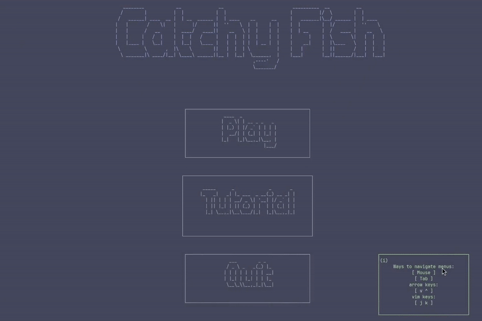
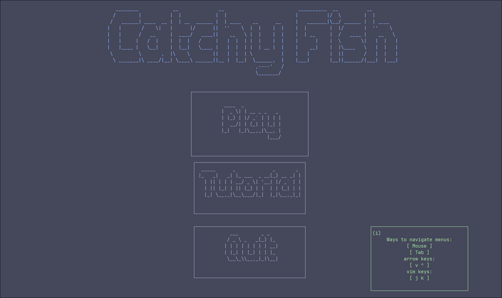
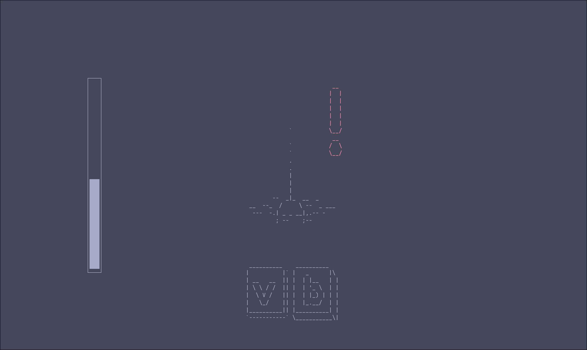
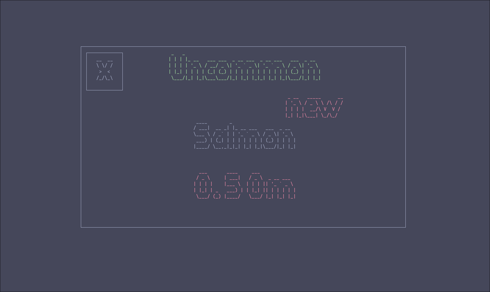

# Catchy Fish

## Introduction

Catchy Fish is a text based fishing mini game that runs in your terminal.
Try to catch all of them.

This project is my final for cis25.






## Installation

### Dependencies

Catchy fish uses the c Library `Ncurses` to draw on the terminal.
You can use your own package manager to install this.
<details><summary> pacman </summary>

```sh
pacman -S ncurses
```

</details>
<details><summary> apt </summary>

```sh
apt-get install libncurses5-dev libncursesw5-dev
```

</details>
<details><summary> homebrew </summary>

```sh
brew install ncurses
```

</details>

### Clone

Use the command below to clone the repo
```sh
git clone https://github.com/BoBz200/CatchyFish
```

## Compile

To compile you can run:

> [!NOTE]
> You can change 'main.out' to what you want

```sh
g++ -l ncurses main.cpp bar.cpp menu.cpp textBox.cpp window.cpp collection.cpp fish.cpp -o main.out
```
